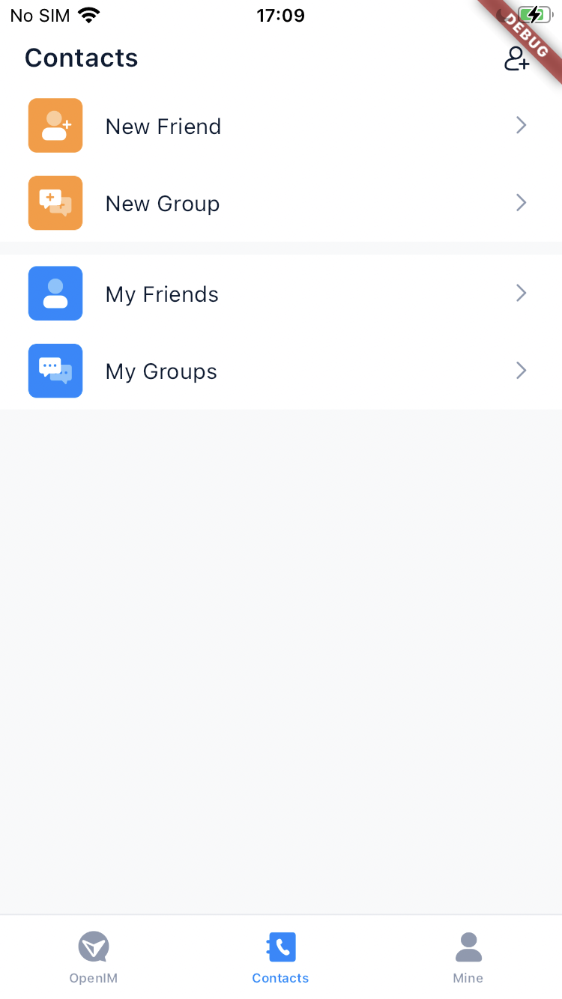
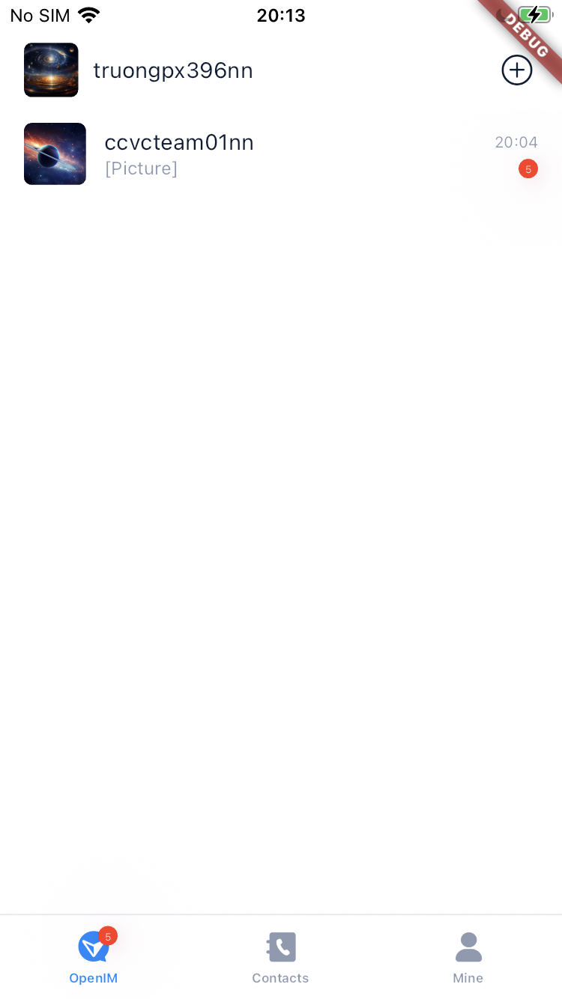
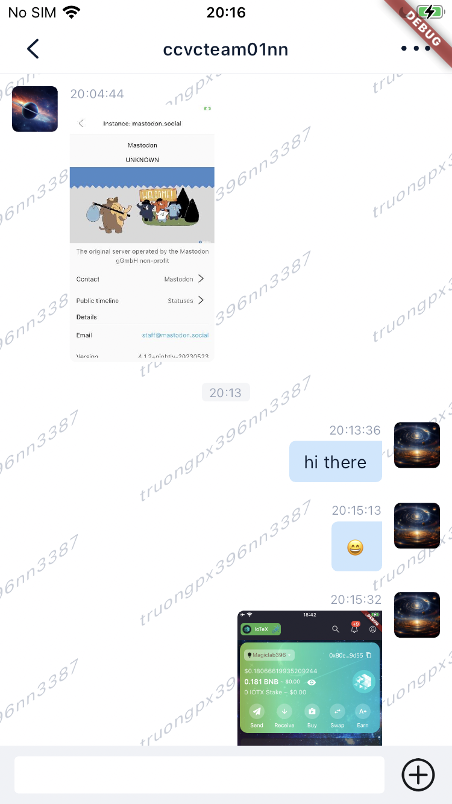
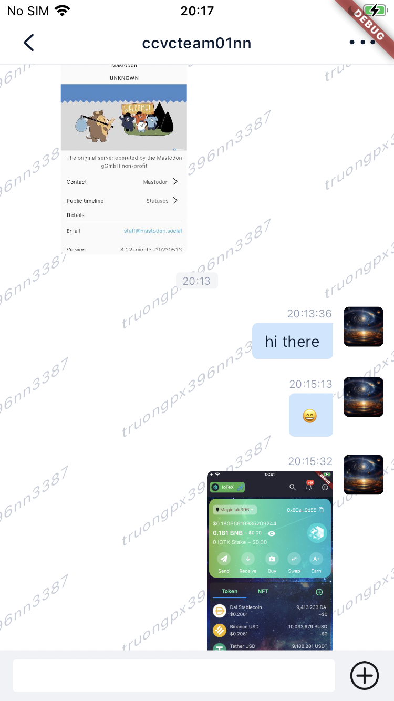
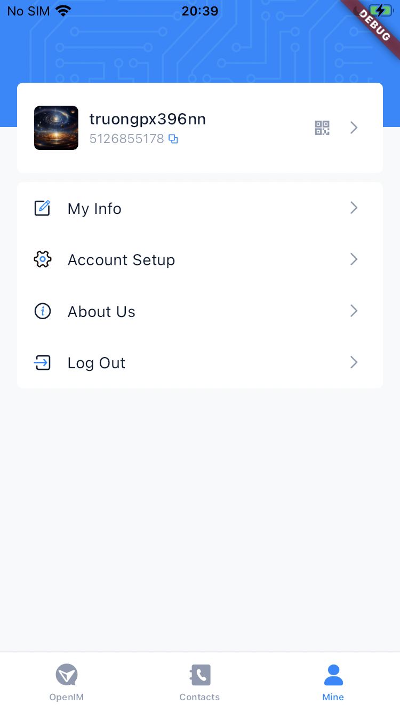

    

# OpenIM Flutter 💬💻

  <a href="https://doc.rentsoft.cn/">OpenIM Docs</a>
  •
  <a href="https://github.com/openimsdk/open-im-server">OpenIM Server</a>
  •
  <a href="https://github.com/openimsdk/openim-sdk-core">openim-sdk-core</a>
  •
  <a href="https://github.com/openimsdk/open-im-sdk-flutter">open-im-sdk-flutter</a>

 

A OpenIM flutter demo, only support android and ios.

## Tech Stack 🛠️

- This is a [`Flutter`](https://flutter.dev/) project.
- App is built with [open-im-sdk-flutter](https://github.com/openimsdk/open-im-sdk-flutter) library.

## Some Screenshots 🚀

  

 

